# How the NAIST Jumat Scheduler works

> Flowcharts of the whole system: what a member sees, what the admin does, what runs by itself, and what to do when the admin changes. This page is part of the website and is updated whenever the system changes.

**Easiest way to read it:** open https://jumat-scheduler-naist.pages.dev/guide on any phone or computer. This file is the same guide for GitHub, which draws the flowcharts too.

*This file is generated (`npm run docs`). Change the flowcharts in `public/flows/*.mmd` and the words in `public/flows/guide.json`, never this file.*

**Colours:** Members and visitors · Admin actions · Automatic (the website and the robot) · Outside services (email, LINE, Google, WhatsApp) · A problem, an alert or something to be careful with (blue · green · grey · orange · red).

**Contents:** [Big picture](#the-big-picture) · [Members](#for-members) · [Admin](#for-the-admin) · [Behind the scenes](#behind-the-scenes) · [New admin](#when-the-admin-changes) · [Setup](#setup-and-what-is-switched-on)

## The big picture

Everything in one view, and what a normal week looks like.

### The system: people, website, robot and messages

Members, scheduled people and the admin all use the same web page. The robot sends the reminders and keeps things in step; the admin posts the announcement in the WhatsApp and Facebook groups by hand.

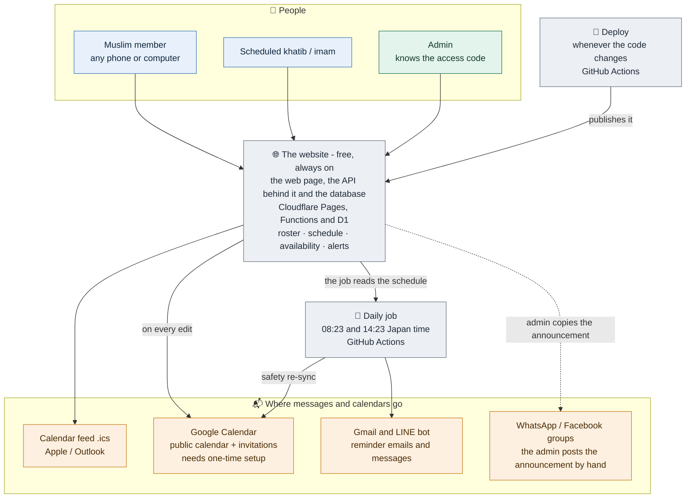

### A normal week

From the first availability mark to the prayer on Friday. Times are Japan time.

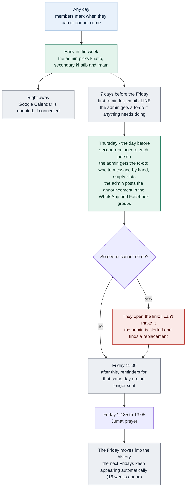

### What the system can do

| Who | Feature | What it does | Status |
| --- | --- | --- | --- |
| Members | See the schedule | A calendar of the Fridays with khatib, imam and venue. | ✅ live |
| Members | Friday details and announcement | Tap a Friday to read it and copy the weekly announcement. | ✅ live |
| Members | Say when you can or cannot come | Choose your name, then I'm available or I'm unavailable. No password. | ✅ live |
| Members | Can't make it link | In every reminder and calendar event: one button that tells the admin you cannot come. | ✅ live |
| Members | Calendar feed | A feed for Apple, Outlook or Google (From URL): 12:35 to 13:05 each Friday with the announcement text. | ✅ live |
| Members | Public Google Calendar | A shared Google Calendar the website keeps up to date within a minute. | 🔧 needs setup |
| Scheduled people | Reminder emails | 7 days before and the day before, to people whose email is on the roster. | ✅ live |
| Scheduled people | Reminder LINE messages | The same reminders on LINE, for people who linked the bot. | ✅ live |
| Scheduled people | Add to Google Calendar link | In every reminder: a ready-made calendar event with their role. | ✅ live |
| Scheduled people | Google Calendar invitation | Invited automatically if their NAIST Google account is on the roster. | 🔧 needs setup |
| Admin | Access code | Unlocks editing. Members never need it. | ✅ live |
| Admin | Roster | Add, edit, mark left NAIST or delete people; their contact details are visible only with the code. | ✅ live |
| Admin | Planner | Pick primary khatib, secondary khatib and imam for every coming Friday, with availability and turns shown. | ✅ live |
| Admin | Copy reminder and WhatsApp buttons | For people the robot cannot reach: copy the text or open WhatsApp with it typed. | ✅ live |
| Admin | Announcement for the groups | Generate and copy the weekly announcement to post in the WhatsApp and Facebook groups. | ✅ live |
| Admin | Admin to-do messages | A week before (only if something needs doing) and the day before: who to message by hand, empty slots, post the announcement. | ✅ live |
| Admin | Can't-make-it alerts | A red box and badge in the planner, and an email, when a scheduled person cannot come. | ✅ live |
| Admin | Google Calendar sync | Status line and a Sync now button in the planner; instant alert emails. | 🔧 needs setup |
| Automatic | Daily job | 08:23 and 14:23 Japan time: reminders, to-dos, alert emails, calendar re-sync. | ✅ live |
| Automatic | Deploy | Every change of the code is published automatically, with its database changes. | ✅ live |

## For members

What anyone can do without a password, and what happens to someone who is scheduled.

### What you can do on the website

No password is needed to look at the schedule, to share the announcement, to add the calendar or to say when you can come.

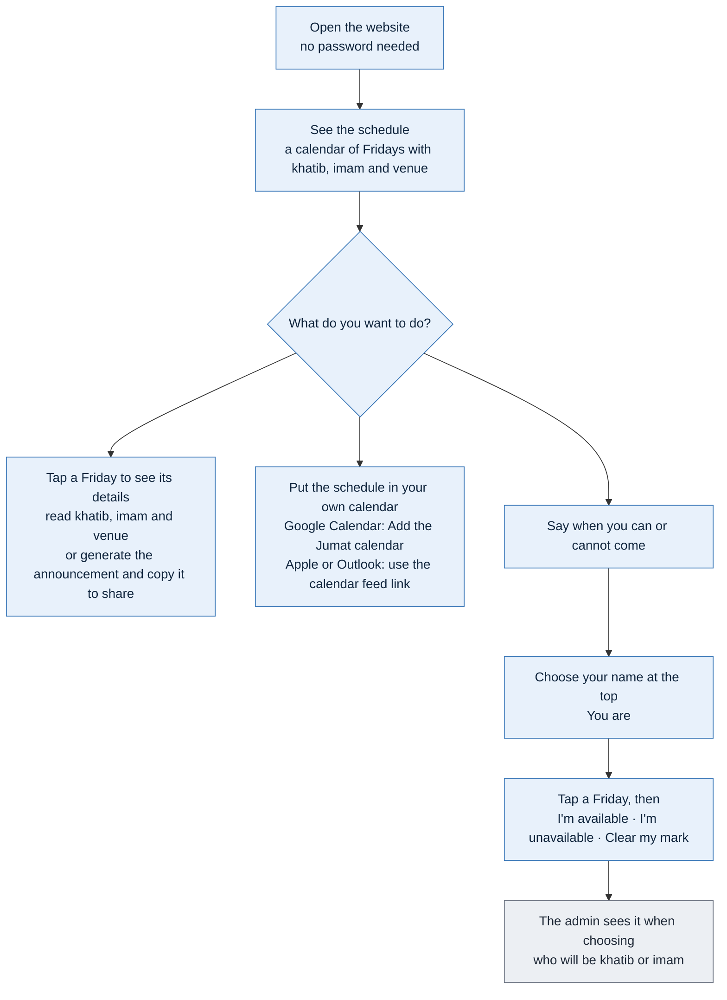

### If you are scheduled as khatib or imam

How you are told, and what to do if you cannot come.

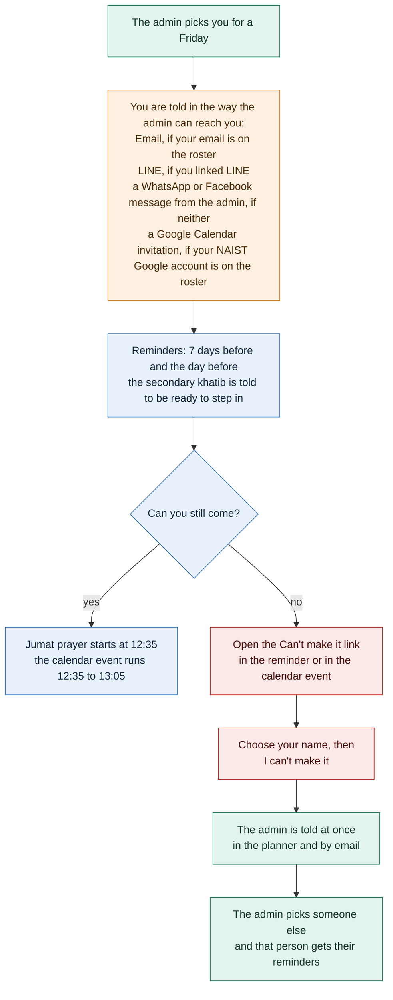

## For the admin

The weekly routine, how to set up the people, and what to do when someone cannot come.

### The weekly routine

Most of it is picking people. The robot sends the reminders; you only send by hand to people the robot cannot reach, and post the announcement in the groups.

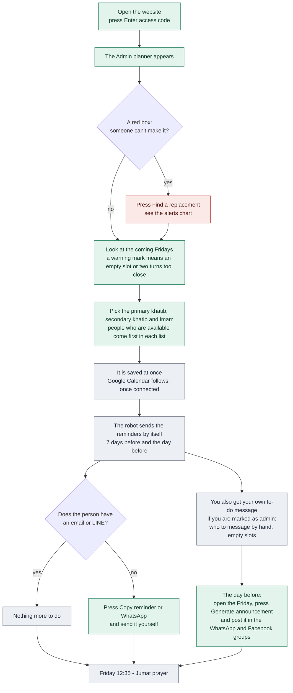

### The roster: people and how to reach them

The more ways a person can be reached, the less you do by hand.

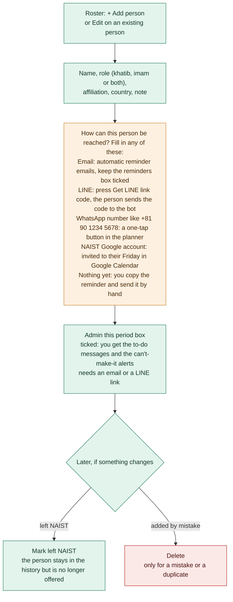

### When someone cannot make it

The alert reaches you on the website and by email, so a replacement can be found early.

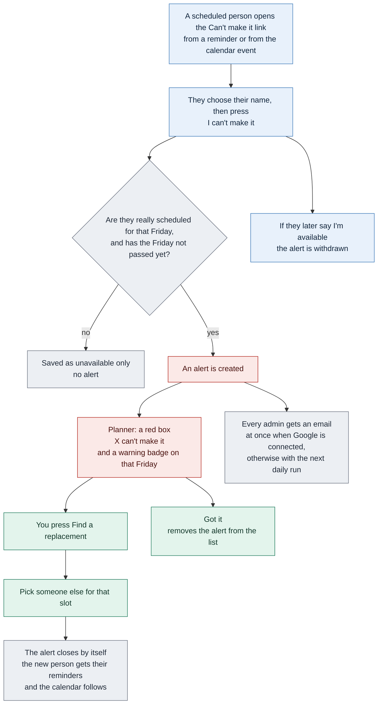

## Behind the scenes

What runs by itself, and the exact list of pages, tables, jobs and settings in the code (this list is written by the code itself, so it is always current).

### What runs when

Three triggers: an edit on the website, the twice-daily job, and a change of the code.

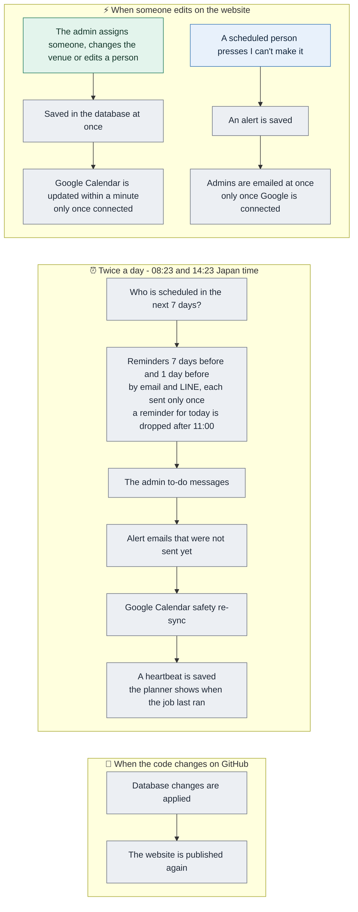

### The exact list, from the code

#### Pages of the API

| Address | What it does | Who can use it |
| --- | --- | --- |
| `/api/access-check` | Checks whether an access code is right, so the page knows to unlock the editing buttons. | GET: public, more with the code |
| `/api/alerts` | The list of can't-make-it alerts waiting for the admin. | GET: access code |
| `/api/alerts/:id` | The admin marks one alert as seen (Got it). | PATCH: access code |
| `/api/availability` | Who can or cannot come on which Friday. Anyone can mark their own. | GET: public, more with the code; POST: public; DELETE: public |
| `/api/calendar/add` | The Add to Google Calendar link in reminders: sends the person to Google with a ready-made event. | GET: public |
| `/api/calendar/info` | Tells the home page whether the shared Google Calendar is connected, to show its buttons. | GET: public |
| `/api/calendar/jumat.ics` | The calendar feed for Apple, Outlook or Google (From URL). | GET: public |
| `/api/calendar/sync` | The planner's Sync now button: makes Google Calendar match the schedule. | POST: access code |
| `/api/fridays` | The schedule: the list of Fridays. It also creates the coming ones. | GET: public |
| `/api/fridays/:id` | Assign khatib and imam, set the venue or a note for one Friday. | PATCH: access code |
| `/api/line/webhook` | Where LINE delivers messages to the bot. This is how a person links their LINE with the code. | POST: LINE signature |
| `/api/people` | The roster: read the list (contact details only with the code) and add a person. | GET: public, more with the code; POST: access code |
| `/api/people/:id` | Edit or delete one person. | DELETE: access code; PATCH: access code |
| `/api/people/:id/line` | Create or remove the code a person uses to link their LINE. | POST: access code; DELETE: access code |
| `/api/reminders/status` | What the planner shows about the reminder job, the admin and Google Calendar. | GET: access code |
| `/api/reminders/unsubscribe` | The stop-these-reminders link at the bottom of every email. | GET: private link; POST: private link |

#### Database tables

| Table | Created by |
| --- | --- |
| `people` | `0001_init.sql` |
| `fridays` | `0001_init.sql` |
| `availability` | `0001_init.sql` |
| `reminder_log` | `0008_reminders.sql` |
| `reminder_runs` | `0008_reminders.sql` |
| `availability_alerts` | `0011_alerts.sql` |
| `gcal_sync` | `0012_gcal.sql` |
| `gcal_state` | `0012_gcal.sql` |

#### Database changes, in order

| File | What it changes |
| --- | --- |
| `0001_init.sql` | Jumat Scheduler NAIST - initial schema |
| `0002_seed.sql` | Jumat Scheduler NAIST - seed data |
| `0003_affiliation_contact.sql` | Broaden the roster beyond NAIST khatib/imam students (outside community |
| `0004_affiliation_categories.sql` | Split the "naist" affiliation into its actual categories: students and |
| `0005_imam.sql` | The original spreadsheet only ever tracked Primary/Secondary khatib per |
| `0006_drop_sensei_role.sql` | "sensei" was added to the role field (prayer-duty capability), but role |
| `0007_backfill_default_venue.sql` | Upcoming Fridays created before the default-venue change were stored with |
| `0008_reminders.sql` | Automatic reminders: where to reach each person, plus a log so nobody gets |
| `0009_whatsapp.sql` | WhatsApp number for the planner's one-tap "send reminder" link. |
| `0010_admin.sql` | Who is the admin this period. |
| `0011_alerts.sql` | "Can't make it" alerts. |
| `0012_gcal.sql` | Google Calendar: one event per Friday on a shared (public) calendar, kept up to |

#### Robot jobs (GitHub Actions)

| Job | When it runs |
| --- | --- |
| Deploy to Cloudflare Pages (`deploy.yml`) | every change on main; by hand |
| Send Jumat reminders (`reminders.yml`) | on a timer: 23:23 UTC = 08:23 JST; on a timer: 05:23 UTC = 14:23 JST; by hand (options: dry_run, google_check, test_email_to_sender, test_email) |
| One-time Cloudflare setup (`setup.yml`) | by hand |

#### Settings and secrets

| Name | Kept in | What it is |
| --- | --- | --- |
| `CLOUDFLARE_ACCOUNT_ID` | GitHub secret | Which Cloudflare account the website lives in. |
| `CLOUDFLARE_API_TOKEN` | GitHub secret | Lets GitHub deploy the website and read the database. |
| `GCAL_BRIDGE_SECRET` | GitHub secret | The shared secret that the website and the Apps Script both must know. |
| `GCAL_BRIDGE_URL` | GitHub secret | Address of the Google Apps Script that edits the shared Google Calendar. |
| `GMAIL_APP_PASSWORD` | GitHub secret | The Gmail app password (16 characters) used to send those emails. |
| `GMAIL_USER` | GitHub secret | The community Gmail address that sends the reminder emails. |
| `LINE_CHANNEL_ACCESS_TOKEN` | GitHub secret | LINE bot: lets the website and the job send LINE messages. |
| `LINE_CHANNEL_SECRET` | GitHub secret | LINE bot: lets the website check that a message really comes from LINE. |
| `SCHEDULER_ACCESS_CODE` | GitHub secret | The community access code (GitHub keeps it; the setup workflow copies it to the website as ACCESS_CODE). |
| `SITE_URL` | GitHub variable | Optional: the website address used inside calendar events and emails, if the site gets its own domain. |
| `ACCESS_CODE` | Website setting | The community access code, as the website sees it. Anyone who knows it can edit the schedule and roster. |
| `GCAL_BRIDGE_SECRET` | Website setting | The shared secret that the website and the Apps Script both must know. |
| `GCAL_BRIDGE_URL` | Website setting | Address of the Google Apps Script that edits the shared Google Calendar. |
| `LINE_CHANNEL_ACCESS_TOKEN` | Website setting | LINE bot: lets the website and the job send LINE messages. |
| `LINE_CHANNEL_SECRET` | Website setting | LINE bot: lets the website check that a message really comes from LINE. |
| `SITE_URL` | Website setting | Optional: the website address used inside calendar events and emails, if the site gets its own domain. |

## When the admin changes

Three levels, from the everyday handover to moving the whole system.

### 1. Hand over the admin job (about 5 minutes)

The everyday case: another person takes over the weekly work.

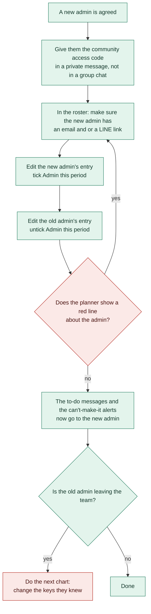

### 2. If the old admin leaves: change the keys they knew

Each key is separate. Change only the ones that person had. Never send a key or password in a chat; give it in a private message or a password manager.

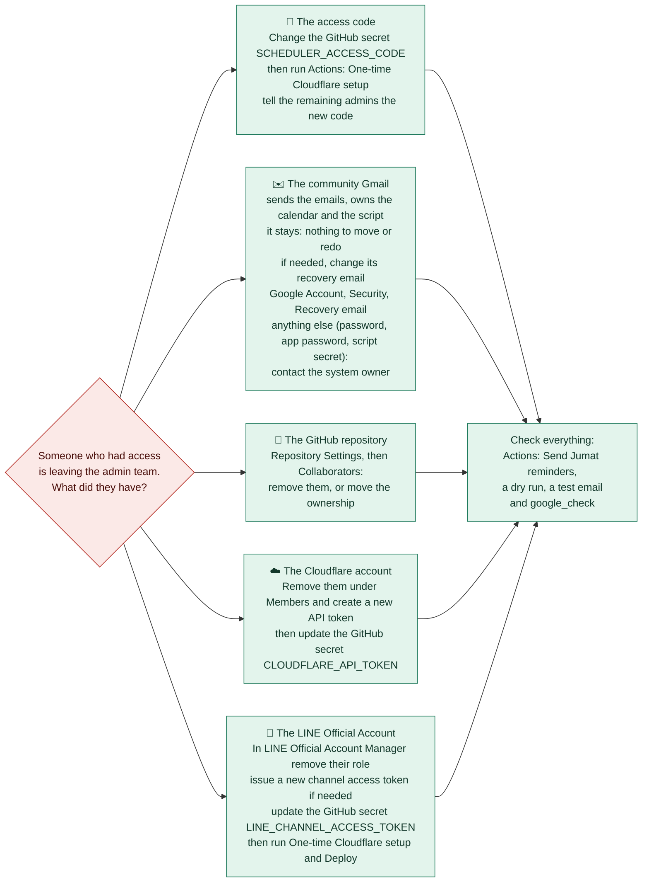

### 3. Moving everything to the new owner's own accounts (rare)

Not rehearsed yet: treat it as a checklist and ask a developer for steps 4 and 6.

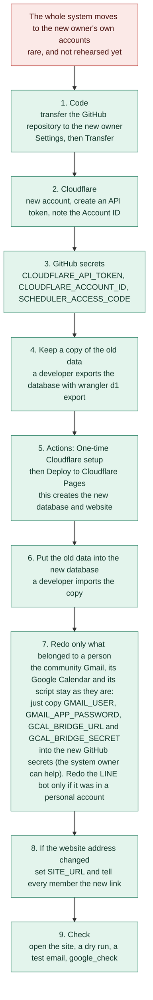

## Setup and what is switched on

The optional parts, which ones are done, and the steps for the Google Calendar connection.

### Connecting Google Calendar (about 15 minutes, once)

Needs the community Gmail account (it stays when admins change) and a computer. Full wording is in the README, section Google Calendar.

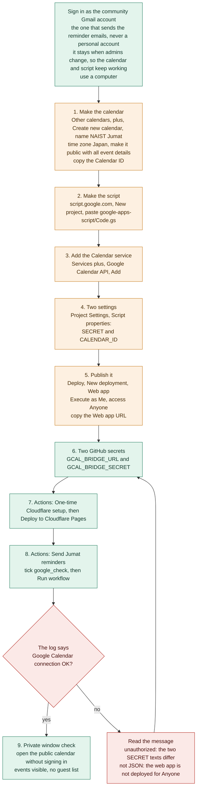

### What is switched on

| Part | Status | Notes |
| --- | --- | --- |
| Website, database and automatic deploy | ✅ done | Live on Cloudflare Pages. |
| Community access code | ✅ done | Set. Change it with the handover chart if an admin leaves. |
| Reminder emails (community Gmail) | ✅ done | Test email received. Add each person's email in the roster to start their reminders. |
| LINE reminders | ✅ done | Bot connected. Each person links with a code from the roster. |
| Google Calendar connection | ⏳ in progress | Not connected yet: follow the chart below. Until then the calendar feed is used. |
| An admin marked in the roster | ☐ to do | Edit your own entry and tick Admin this period (needs an email or LINE link). |
| GitHub default branch set to main | ☐ to do | Recommended: Settings, Branches. The scheduled job runs the code on main either way. |
